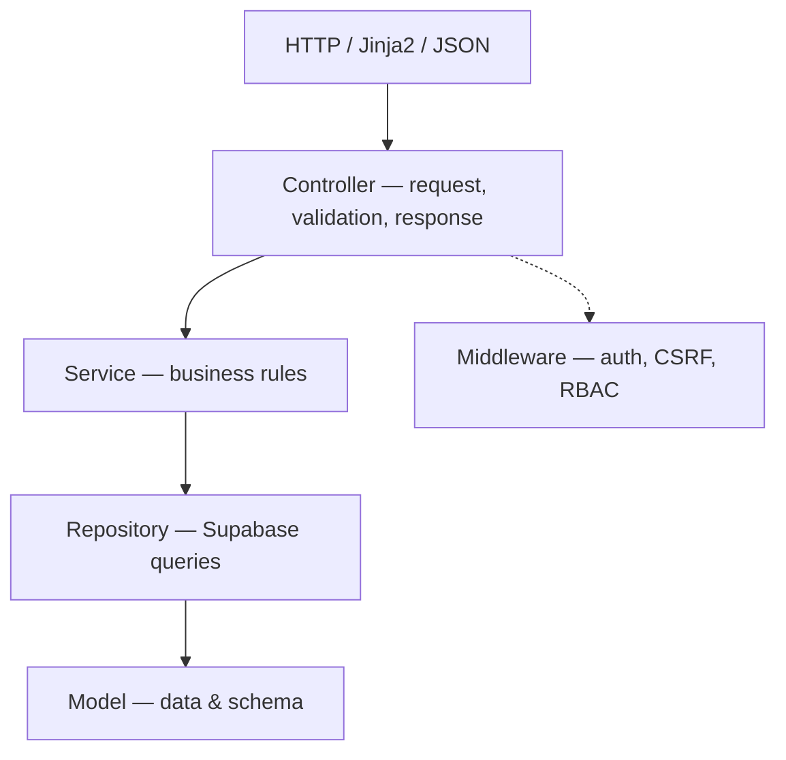
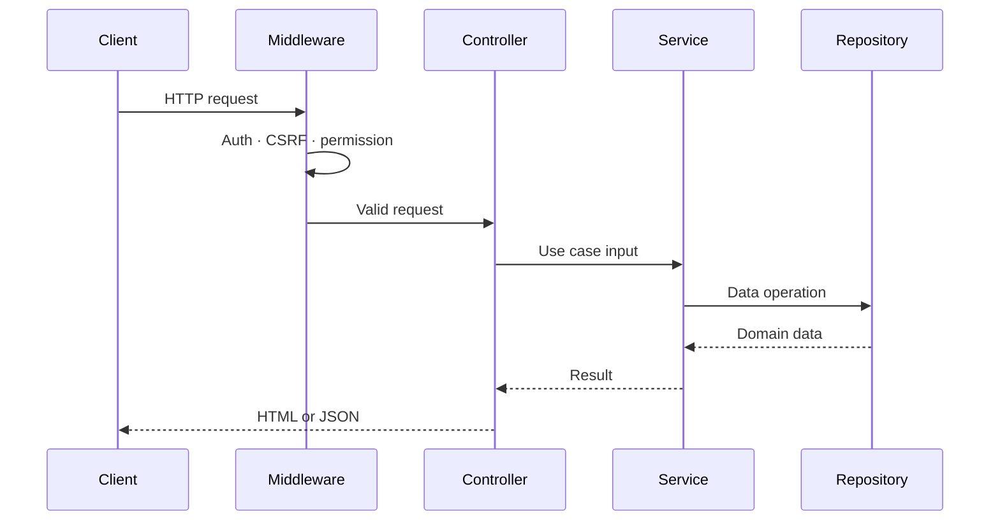
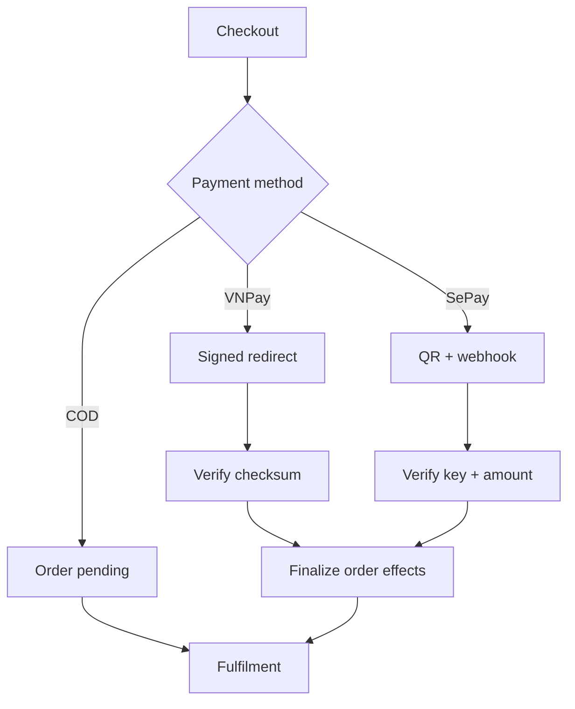

<div align="center">


# GUAMAISON

### Fashion commerce, engineered for both shoppers and operators.

**Nền tảng thương mại điện tử thời trang full-stack** — kết hợp storefront hiện đại, hệ thống quản trị vận hành, POS tại quầy, thanh toán nội địa Việt Nam và trợ lý mua sắm AI trong một kiến trúc thống nhất, có ranh giới rõ ràng và sẵn sàng vận hành thật.

<br/>

[](https://www.python.org/)
[](https://flask.palletsprojects.com/)
[](https://supabase.com/)
[](https://tailwindcss.com/)
[](https://vercel.com/)

<sub>💼 Portfolio project — full-stack engineering, commerce workflows & operational UX</sub>

<br/>

**[📋 Điểm nổi bật](#highlights) · [🧩 Bản đồ tính năng](#feature-map) · [🏗️ Kiến trúc](#architecture) · [⚡ Cài đặt nhanh](#quick-start) · [🔐 Bảo mật](#security) · [🚀 Recruiter fast-track](#recruiter-fast-track)**

</div>

<br/>

<div align="center">

| 🧱 Modules | 💳 Payment rails | 🧠 AI-assisted | 🏬 Omnichannel | 📐 Layers |
|:---:|:---:|:---:|:---:|:---:|
| **11** khu vực nghiệp vụ | COD · VNPay · SePay | Assistant + Styling Lab | Web + POS | Controller → Service → Repository → Model |

</div>

---

<a id="overview"></a>

## 🎯 Một sản phẩm, hai trải nghiệm hoàn chỉnh

GUAMAISON không dừng lại ở một website trưng bày sản phẩm. Dự án mô phỏng **toàn bộ vòng đời của một hệ thống bán lẻ thời trang thật**: khách hàng khám phá và mua sắm trực tuyến, trong khi đội ngũ nội bộ vận hành catalog, tồn kho, đơn hàng, khách hàng, nội dung, khuyến mãi và bán hàng tại quầy — tất cả trên cùng một nguồn dữ liệu.

<table>
<tr>
<td width="50%" valign="top">

**🛍️ Customer experience**
Tìm kiếm, lọc, biến thể màu/size, Quick View, yêu thích, giỏ hàng, checkout, thanh toán, theo dõi đơn.

**⚙️ Commerce operations**
Sản phẩm, kho, coupon, đơn hàng, đổi trả, vận chuyển, khách hàng, thông báo, báo cáo.

</td>
<td width="50%" valign="top">

**🏪 Omnichannel**
Storefront online kết hợp POS tại quầy — đồng bộ sản phẩm, khách hàng, tồn kho và loyalty theo thời gian thực.

**🧠 Intelligent experience**
AI Assistant và Styling Lab vận hành với Gemini, có fallback rule-based nội bộ khi chưa cấu hình.

</td>
</tr>
</table>

> **Trọng tâm kỹ thuật:** biến một bài toán e-commerce nhiều luồng nghiệp vụ thành codebase Flask có ranh giới rõ ràng, bảo mật theo vai trò (RBAC) và khả năng vận hành thực tế — không phải một demo CRUD.

---

<a id="highlights"></a>

## ✨ Điều làm GUAMAISON khác biệt

### 1️⃣ Thanh toán được xử lý như một workflow, không phải một nút bấm

- 💳 **VNPay** — tạo URL thanh toán phía server, xác minh checksum khi callback, chỉ hoàn tất đơn khi chữ ký hợp lệ.
- 📱 **SePay** — nhận webhook, xác thực API key, tách mã đơn, đối chiếu số tiền, bỏ qua giao dịch trùng.
- 🔄 Sau khi xác nhận thanh toán: hệ thống đồng bộ **trạng thái đơn → log giao dịch → tồn kho → analytics → coupon usage → giỏ hàng** trong một chuỗi hiệu ứng nhất quán.

### 2️⃣ Admin là một sản phẩm riêng, không phải trang phụ

- 📊 Dashboard, báo cáo, quản lý sản phẩm/biến thể, tồn kho, đơn hàng, khách hàng.
- 🔐 RBAC theo permission code cho `staff`, `admin` và nhóm quyền tùy chỉnh.
- 📝 Audit log ghi nhận mọi thao tác quản trị nhạy cảm.
- 🎨 Storefront CMS quản lý menu, footer, media, thông báo, cấu hình hiển thị.
- 🧾 POS hỗ trợ barcode/SKU, coupon, loyalty, tiền mặt, chuyển khoản, giao hàng sau.

### 3️⃣ AI có graceful fallback — không bao giờ làm hỏng trải nghiệm chính

- 🤖 **AI Assistant**: tìm sản phẩm, tư vấn size, phối đồ, chính sách, tra cứu đơn hàng bằng ngôn ngữ tự nhiên.
- 👗 **Styling Lab**: xếp hạng gợi ý trang phục theo style profile và dữ liệu sản phẩm thực tế.
- 🛡️ Nếu chưa cấu hình Gemini, hệ thống tự động chuyển sang **rule-based fallback** thay vì để trải nghiệm gãy.

### 4️⃣ Tối ưu cho vận hành thật, không chỉ cho demo

- 🚚 Adapter vận chuyển tách biệt cho GHN, tự giao và mock provider — dễ mở rộng thêm hãng vận chuyển.
- ⚡ Global context cache giảm truy vấn Supabase lặp lại, tăng tốc độ phản hồi.
- 🔃 Cache tự động invalidate sau khi Admin cập nhật storefront — nội dung mới hiển thị ngay lập tức.
- 🗂️ Static assets có cache header dài hạn khi deploy trên Vercel.

---

<a id="feature-map"></a>

## 🧩 Bản đồ tính năng

| Khu vực | Tính năng tiêu biểu |
|---|---|
| 🛍️ **Storefront** | Hero/banner, collection, search, filter, pagination, Quick View, snackbar, responsive navigation |
| 👕 **Catalog** | Sản phẩm, category, collection, product group, ảnh, biến thể màu/size, size chart, SKU, barcode, tồn kho |
| 🛒 **Cart & checkout** | Giỏ hàng theo người dùng, cập nhật line item, địa chỉ giao hàng, phí vận chuyển, coupon, tạo đơn |
| 💳 **Payments** | COD, VNPay, SePay QR/webhook, payment log, trạng thái thanh toán, chống giao dịch trùng |
| 👤 **Customer account** | Đăng ký/đăng nhập, hồ sơ, đổi mật khẩu, sổ địa chỉ, yêu thích, lịch sử & chi tiết đơn |
| 🎁 **Growth** | Coupon, promotion, newsletter, notification, loyalty point, member tier |
| 🚚 **Operations** | Đơn hàng, shipment, shipping provider, tồn kho, đổi/trả, customer management |
| 🧾 **POS** | Tra cứu SKU/barcode, khách hàng nhanh, coupon, loyalty, VAT, tiền khách đưa, giao hàng sau |
| 📊 **Analytics** | Product events, doanh thu, báo cáo vận hành, xuất dữ liệu Excel, dashboard |
| 🧠 **AI experience** | Product discovery assistant, size/policy support, outfit suggestion, Styling Lab |
| 🧩 **Admin CMS** | Menu động, footer, storefront media, cài đặt hệ thống, role/permission, audit log |

<details>
<summary><strong>🛤️ Xem hành trình mua hàng từ đầu đến cuối</strong></summary>
<br/>

1. Khách hàng tìm hoặc lọc sản phẩm theo nhu cầu.
2. Chọn biến thể màu, kích thước và số lượng còn trong kho.
3. Thêm vào giỏ, áp coupon, chọn địa chỉ giao hàng.
4. Hệ thống tính phí vận chuyển và tạo snapshot thông tin line item.
5. Khách chọn phương thức thanh toán: COD, VNPay hoặc SePay.
6. Callback/webhook hợp lệ cập nhật payment, order, inventory, analytics.
7. Khách theo dõi đơn trong hồ sơ; Admin tiếp tục xử lý vận chuyển hoặc đổi trả.

</details>

---

<a id="architecture"></a>

## 🏗️ Kiến trúc

GUAMAISON chuẩn hóa các module mới và các phần được refactor theo mô hình **bốn tầng**. Mục tiêu: giữ HTTP, nghiệp vụ và truy cập dữ liệu tách biệt để dễ kiểm thử, dễ thay đổi, dễ mở rộng.



| Tầng | Trách nhiệm | Không nên chứa |
|---|---|---|
| **Controller** | Params, validation cơ bản, HTTP response, template/JSON | Business rule hoặc query Supabase |
| **Service** | Use case, workflow, tính toán và chính sách nghiệp vụ | `request`, `session` hoặc render template |
| **Repository** | Nơi tập trung mọi query Supabase | HTTP và logic trình bày |
| **Model** | Dataclass, schema và cấu trúc dữ liệu | Side effect hoặc điều phối workflow |

<details>
<summary><strong>🔁 Request lifecycle</strong></summary>



</details>

<details>
<summary><strong>💰 Payment lifecycle</strong></summary>



</details>

### 📁 Cấu trúc thư mục

```text
fashion_store/
├── index.py                       # Local entry point + Vercel WSGI app
├── config/                        # Environment-driven configuration
├── app/
│   ├── controllers/               # Storefront, API and admin controllers
│   ├── services/                  # Business workflows and integrations
│   │   └── shipping/              # GHN, self-ship and mock adapters
│   ├── repositories/              # Supabase data-access boundary
│   ├── models/                    # Domain data and schema helpers
│   ├── schemas/                   # Request/response schemas
│   ├── middleware/                # Authentication and permissions
│   ├── templates/                 # Jinja2 pages, partials and components
│   ├── static/                    # CSS, Vanilla JS, images and video
│   └── utils/                     # Security and Supabase clients
├── migrations/                    # Base SQL migrations
├── supabase/migrations/           # Incremental Supabase migrations
├── requirements.txt
└── vercel.json
```

---

<a id="stack"></a>

## 🛠️ Tech stack

| Layer | Technology |
|---|---|
| **Backend** | Python 3.10+, Flask 3.x, Flask-WTF, Flask-Session, Jinja2 |
| **Frontend** | Tailwind CSS, Vanilla JavaScript, Font Awesome, responsive Jinja2 components |
| **Data** | Supabase PostgreSQL, Supabase Storage |
| **Payments** | VNPay, SePay webhook, COD |
| **AI** | Google GenAI/Gemini với local fallback |
| **Operations** | APScheduler, SendGrid/email, Pandas, OpenPyXL, QR generation |
| **Deployment** | Vercel Python runtime, immutable static-asset cache |

---

<a id="recruiter-fast-track"></a>

## 🚀 Recruiter fast-track — xem gì trong 3 phút?

| ⏱️ | 📂 File đáng xem | 💡 Vì sao đáng chú ý |
|---|---|---|
| 30s | `app/services/vnpay_service.py` | Chữ ký thanh toán được tạo và xác minh phía server |
| 30s | `app/controllers/sepay_controller.py` | Webhook có API-key guard, amount reconciliation, duplicate protection |
| 30s | `app/services/rbac_service.py` | Permission catalog, custom role, server-side authorization |
| 30s | `app/controllers/admin/pos_controller.py` | Workflow bán tại quầy nhiều nghiệp vụ trong cùng một module |
| 30s | `app/services/chat_service.py` | AI intent handling, product search, graceful fallback |
| 30s | `index.py` + `vercel.json` | Context caching, cache invalidation, cấu hình serverless deployment |

---

<a id="quick-start"></a>

## ⚡ Chạy dự án cục bộ

### Yêu cầu

- Python 3.10+
- Một Supabase project
- Git và virtual environment
- VNPay/SePay/Gemini — chỉ cần khi muốn bật integration tương ứng

### 1. Tạo môi trường và cài dependency

```bash
python -m venv .venv
```

**Windows PowerShell:**

```powershell
.\.venv\Scripts\Activate.ps1
python -m pip install --upgrade pip
pip install -r requirements.txt
Copy-Item .env.example .env
```

**macOS/Linux:**

```bash
source .venv/bin/activate
python -m pip install --upgrade pip
pip install -r requirements.txt
cp .env.example .env
```

### 2. Cấu hình môi trường

```env
# Core
FLASK_DEBUG=True
SECRET_KEY=replace-with-a-long-random-value
APP_URL=http://127.0.0.1:5000

# Supabase
SUPABASE_URL=https://your-project.supabase.co
SUPABASE_KEY=your-anon-key
SUPABASE_SERVICE_ROLE_KEY=your-server-only-service-role-key

# VNPay — optional
VNPAY_TMN_CODE=
VNPAY_HASH_SECRET=
VNPAY_PAYMENT_URL=https://sandbox.vnpayment.vn/paymentv2/vpcpay.html
VNPAY_RETURN_URL=http://127.0.0.1:5000/payment/vnpay_return

# SePay — optional
SEPAY_BANK_CODE=
SEPAY_BANK_ACCOUNT=
SEPAY_ACCOUNT_NAME=
SEPAY_WEBHOOK_API_KEY=

# AI — optional; local fallback remains available
ENABLE_AI=false
GEMINI_API_KEY=
GEMINI_MODEL=gemini-2.0-flash
```

> ⚠️ Không commit `.env`, Supabase service-role key, payment secret hoặc webhook key. Chỉ sử dụng service-role key trong code chạy phía server.

### 3. Khởi tạo database

1. Mở **Supabase Dashboard → SQL Editor**.
2. Chạy migration nền trong `migrations/` theo thứ tự.
3. Chạy migration bổ sung trong `supabase/migrations/` theo timestamp.
4. Kiểm tra lại bảng, Storage bucket và RLS policy trước khi dùng dữ liệu thật.

### 4. Chạy Flask

```bash
python index.py
```

Mở `http://127.0.0.1:5000` 🎉

<details>
<summary><strong>🔧 Các nhóm biến môi trường khác</strong></summary>
<br/>

- SMTP/SendGrid cho email và newsletter.
- GHN hoặc provider giao vận được chọn.
- POS loyalty rate, point value, store account và VAT mặc định.
- Global context cache TTL và giới hạn upload.
- Feature flags cho AI, analytics và tích hợp tùy chọn.

Hãy dùng `.env.example` làm nguồn cấu hình chuẩn và cập nhật file này khi thêm biến mới.

</details>

---

<a id="security"></a>

## 🔐 Security & reliability

| Rủi ro | Cách hệ thống xử lý |
|---|---|
| **Secret leakage** | Đọc secret qua environment; service-role key chỉ dùng server-side |
| **Form forgery** | Flask-WTF CSRF token cho form; chỉ exempt endpoint webhook cần thiết |
| **Unauthorized admin access** | Middleware đăng nhập + RBAC theo permission code |
| **Payment tampering** | VNPay checksum validation; SePay API key và amount reconciliation |
| **Duplicate webhook** | Kiểm tra transaction đã tồn tại trước khi ghi payment |
| **Password exposure** | Hash mật khẩu bằng bcrypt |
| **Unsafe upload** | Allowlist extension/MIME, giới hạn dung lượng, upload Storage phía server |
| **Sensitive mutations** | Audit log cho thao tác Admin/Staff |
| **Database access** | RLS được review sau mỗi migration; service role không expose ra browser |

<details>
<summary><strong>✅ Production checklist</strong></summary>
<br/>

- [ ] `FLASK_DEBUG=False` và `SECRET_KEY` đủ mạnh.
- [ ] RLS policy đã được audit cho mọi bảng public-facing.
- [ ] VNPay return URL và SePay webhook trỏ đúng production domain.
- [ ] Payment secrets chỉ tồn tại trong environment của server.
- [ ] Storage policy và giới hạn upload đã được kiểm tra.
- [ ] Không commit `.env`, `.gua-backups/`, dump database hoặc file người dùng upload.
- [ ] Chạy test checkout/payment trên sandbox trước khi nhận giao dịch thật.

</details>

---

<a id="engineering-notes"></a>

## 🧠 Những quyết định kỹ thuật đáng chú ý

- **Progressive enhancement** — Jinja2 render nội dung chính; Vanilla JS nâng cấp tương tác thay vì bắt buộc SPA framework.
- **Reusable UI** — navbar, footer, modal, snackbar và home sections được tách thành partial/component.
- **Integration isolation** — payment, shipping, email và AI được đặt sau service/adapter để dễ thay thế.
- **Defensive workflows** — payment side effects chỉ chạy sau bước xác minh; lỗi tích hợp tùy chọn không làm sập storefront.
- **Operational consistency** — POS và online commerce dùng chung domain data cho sản phẩm, kho, khách hàng và loyalty.
- **Performance awareness** — global context cache, explicit cache invalidation và immutable static assets trên Vercel.

---

<a id="roadmap"></a>

## 🗺️ Next engineering milestones

- [ ] Di chuyển nốt các truy vấn Supabase legacy khỏi Controller/Model vào Repository.
- [ ] Bổ sung unit test cho Service và integration test cho VNPay/SePay webhook.
- [ ] Thêm CI chạy lint, test, migration check và secret scanning cho pull request.
- [ ] Chuẩn hóa transaction/RPC cho checkout, POS và inventory side effects.
- [ ] Upload media lớn trực tiếp tới Supabase Storage để phù hợp giới hạn serverless.
- [ ] Bổ sung observability: structured logging, error tracking, payment alert.
- [ ] Hoàn thiện screenshot/GIF product tour và public demo environment.

---

<a id="conventions"></a>

## 📐 Quy ước đóng góp

```text
Controller  → HTTP only
Service     → Pure business logic
Repository  → Supabase access only
Model       → Data and schema only
Template    → Presentation with reusable partials
```

Một thay đổi được xem là hoàn chỉnh khi:

- ✅ Không hardcode secret hoặc production URL.
- ✅ Có validation và permission guard phù hợp.
- ✅ Không gọi Supabase trực tiếp ngoài Repository đối với code mới/refactor.
- ✅ Form mutation có CSRF; webhook có cơ chế xác thực riêng.
- ✅ UI hoạt động tốt trên desktop/mobile, keyboard focus rõ ràng.
- ✅ Migration được thêm mới theo thứ tự; không sửa migration đã chạy trên production.

---

<div align="center">

### Built with product thinking, not only code.

**GUAMAISON © 2026** · Flask · Supabase · Vanilla JS · Vietnam-ready commerce

<sub>A portfolio project demonstrating full-stack engineering, commerce workflows and operational UX.</sub>

</div>